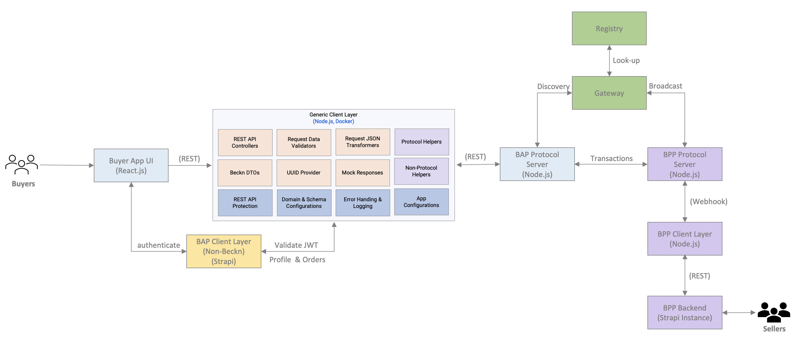
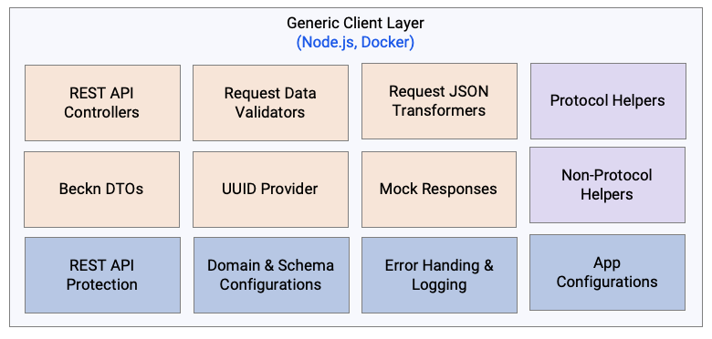

# BB Generic Client Layer

## Overall Architecture

Objective is to build domain-agnostic, reusable components for beckn applications, that  can be configured and used across various domains. This requires a flexible and modular architecture, that can adapt to various domains with minimal code changes.



The frontend (UI layer), and the backend-for-frontend (beckn client layer) should be assembled using building blocks. For example: a building block in the BFF is an API to process a search request, and a building block in the Frontend is a react component with search criteria, and display responses coming back from the API request.

Each building block within the components can be dynamically enabled or disabled using feature toggles.

## UI Components
There are multiple domain specific ecommerce UI apps, created using React. Domains are retail, mobility, healthcare, pharmacy, skilling etc. The UI is composed out of building blocks, that reduce repetitive coding. The UI components and app are in a monorepo.

1. **Building Blocks Library:**

   - A centralized library of reusable building blocks/components for each domain will be created using React.
   - These components will encapsulate domain-specific functionality and styling, reducing repetitive coding efforts.

2. **Monorepo Structure:**

   - The UI components and apps will be organized in a monorepo for efficient code sharing and versioning.
   - Each domain-specific app will be a separate package within the monorepo.

3. **App Composition:**

   - Each domain-specific app will import and use the building blocks from the central library.
   - These building blocks will be customized based on the specific needs of each domain.

The UI interacts with 2 API backends, for beckn protocol and non-protocol interactions.

### Non-Protocol Interactions

The first backend supports non-protocol interactions, such as user registration, login, profile and order history. There could be documents attached to an user profile (example: resume). There could be documents attached to order history too (example: prescription, medical report or receipt).

<TODO: Add details about Strapi client layer here>

### Beckn-Protocol Interactions

The second backend supports beckn protocol interactions. It offers a simplified API to UI apps, and converts the request into beckn protocol format, and makes a call to send or retrieve data from the beckn network. It also takes care of signing the payloads as required by beckn.



This client layer will offer a simplified synchronous API to the UI. It will expose REST APIs for the following operations:

1. Search (search)
2. Add to Cart (select)
3. Checkout (init)
4. Place Order (confirm)
5. Track Order (status and track)
6. Update Order (update)
7. Cancel Order (cancel)
8. Customer Support (support)

All these APIs will accept requests from multiple domains. BAP domain will be passed as a header parameter along with all the API requests.

The API implementation will extract attributes from the request JSON, validate the values, and then transform the JSON into beckn protocol request structure.

A JavaScript library will be created to transform a JSON input from one format to another based on mapping rules. This involves defining a mapping schema and implementing a function that applies these rules to transform the input JSON accordingly. This will be done in two steps:

1. **Define the Mapping Rules:**
   Define a mapping schema that outlines how the source JSON properties should be transformed to the target format.

2. **Implement the Transformation Function:**
   Create a function that iterates through the source JSON and applies the mapping rules to transform the JSON properties as per the schema. The logic to apply the mapping rules and transform the source JSON will be implemented accordingly.

Here's a basic example (1:1 mapping) of a JavaScript method for JSON transformation based on mapping rules:

```javascript
class JsonTransformer {
  constructor(mappingSchema) {
    this.mappingSchema = mappingSchema;
  }

  transform(inputJson) {
    if (!inputJson || typeof inputJson !== 'object') {
      throw new Error('Input JSON is invalid.');
    }

    const transformedJson = {};

    for (const key in this.mappingSchema) {
      const sourceKey = this.mappingSchema[key];

      // Apply transformation based on the mapping rules
      transformedJson[key] = inputJson[sourceKey];
    }

    return transformedJson;
  }
}

// Example usage
const mappingSchema = {
  'newProperty1': 'oldProperty1',
  'newProperty2': 'oldProperty2'
};

const inputJson = {
  'oldProperty1': 'value1',
  'oldProperty2': 'value2'
};

const transformer = new JsonTransformer(mappingSchema);
const transformedJson = transformer.transform(inputJson);

console.log(transformedJson); // Output: { newProperty1: 'value1', newProperty2: 'value2' }
```

The `JsonTransformer` class that takes a mapping schema during initialization and has a `transform` method to apply the mapping rules and transform the JSON based on those rules. The mapping schema and transformation logic will be implemented to process API requests for all domains.

The `JsonTransformer` class can be enhanced to support multiple source-to-target mapping rules. It will also classify incoming JSON into a category based on a set criteria. The `transform` method will then apply the appropriate transformation rules based on the category.

Here's the updated code:

```javascript
class JsonTransformer {
  constructor(mappingSchemas) {
    this.mappingSchemas = mappingSchemas;
  }

  classifyJson(json) {
    // Implement your classification logic here based on the JSON structure or properties
    // For simplicity, let's assume a property 'category' determines the category
    return json.category;
  }

  transform(inputJson) {
    if (!inputJson || typeof inputJson !== 'object') {
      throw new Error('Input JSON is invalid.');
    }

    const category = this.classifyJson(inputJson);

    if (!this.mappingSchemas[category]) {
      throw new Error(`No mapping schema found for category: ${category}`);
    }

    const mappingSchema = this.mappingSchemas[category];
    const transformedJson = {};

    for (const targetKey in mappingSchema) {
      const sourcePath = mappingSchema[targetKey].split('.');
      let sourceValue = inputJson;

      // Traverse the source path
      for (const key of sourcePath) {
        if (sourceValue && sourceValue.hasOwnProperty(key)) {
          sourceValue = sourceValue[key];
        } else {
          sourceValue = undefined;
          break;
        }
      }

      // Assign the source value to the target key
      transformedJson[targetKey] = sourceValue;
    }

    return transformedJson;
  }
}

// Example usage
const mappingSchemas = {
  'category1': {
    'newProperty1': 'oldObject.oldProperty1',
    'newProperty2': 'oldObject.oldProperty2'
  },
  'category2': {
    'newPropertyA': 'oldPropertyA',
    'newPropertyB': 'oldPropertyB'
  }
};

const inputJsonCategory1 = {
  'category': 'category1',
  'oldObject': {
    'oldProperty1': 'value1',
    'oldProperty2': 'value2'
  }
};

const inputJsonCategory2 = {
  'category': 'category2',
  'oldPropertyA': 'valueA',
  'oldPropertyB': 'valueB'
};

const transformer = new JsonTransformer(mappingSchemas);

const transformedJsonCategory1 = transformer.transform(inputJsonCategory1);
const transformedJsonCategory2 = transformer.transform(inputJsonCategory2);

console.log('Transformed JSON for category 1:', transformedJsonCategory1);
console.log('Transformed JSON for category 2:', transformedJsonCategory2);
```

The `classifyJson` method is used to determine the category based on some criteria (e.g., a property named 'category' in the input JSON). The `transform` method then selects the appropriate mapping schema based on the category and applies the transformation accordingly.


## Feature Flag Service
This application has an UI that allows control of feature flags without changing the code by using a feature flag service. Administrators can toggle feature flags on or off dynamically without modifying the application's code. Toggle these flags on or off, change their targeting rules and validate results on the application.

Feature flags are stored in the configuration management system. The frontend and backend applications fetch these configurations at runtime. The state of feature flags can be changed without re-deploying the application.

## Sample Usage of Feature Flag in Node.js
```
// Load configuration from a configuration file or environment variables
const featureConfig = {
  searchEnabled: process.env.SEARCH_ENABLED === 'true',
  // Add more feature flags as needed
};

// Middleware to parse JSON requests
app.use(bodyParser.json());

// Search endpoint
app.post('/api/search', (req, res) => {
  if (!featureConfig.searchEnabled) {
    return res.status(404).json({ message: 'Search feature is disabled' });
  }

  // Rest of your search logic
});

// Other endpoints and application logic
```

## Release Notes

### v1.0.0 - Initial Release
- First public release of the BB Generic Client Layer
- Core architecture implementation with domain-agnostic components
- Basic building blocks for UI and BFF layers
- Initial feature flag service integration
- Support for basic JSON transformation utilities

### v1.1.0 - Beckn Protocol Integration
- Implemented full support for Beckn protocol endpoints
- Added standardized API endpoints for search, select, init, confirm, status, track, update, cancel, and support operations
- Enhanced JSON transformation capabilities for Beckn protocol compliance
- Improved request/response handling for Beckn network interactions

### v1.2.0 - Enhanced Input Handling
- Added support for x-input in all Beckn protocol requests
- Implemented flexible input validation and transformation
- Enhanced error handling for input processing
- Updated documentation for x-input usage across domains

### v1.3.0 - Tag Management System
- Introduced comprehensive tag support for items and providers
- Added tag-based filtering and categorization capabilities
- Enhanced search functionality with tag-based queries
- Implemented tag management APIs for dynamic tag updates

### v1.4.0 - Unsolicited Status Updates
- Added support for unsolicited order status updates across all domains
- Enhanced order tracking capabilities with push-based updates
- Added webhook support for status change updates
